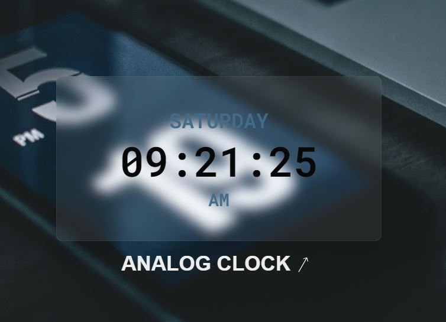

# Digital Clock README

This README provides information about a digital clock built using HTML, CSS, and JavaScript. The digital clock is designed to display the current time in a 12-hour format (AM/PM).

## Features

- Displays the current time accurately in a digital format.
- Updates in real-time without the need for refreshing the page.
- Adapts to different screen sizes and is responsive.

## Links

Live link url [here](https://kizitech.github.io/Digital-Clock/)

## Technologies Used

- HTML: Provides the structure and layout of the clock.
- CSS: Handles the styling and appearance of the clock.
- JavaScript: Retrieves the current time and updates the clock display.

## Files

The following files are included in this project:

1. `index.html` - Contains the HTML structure of the digital clock.
2. `style.css` - Defines the styles and layout of the digital clock.
3. `script.js` - Implements the JavaScript logic for updating the clock.

## Usage

To use the digital clock, follow these steps:

1. Clone or download the project files to your local machine.
2. Open the `index.html` file in a web browser.

The digital clock will be displayed on the page, showing the current time. The clock will automatically update every second to reflect the accurate time.

## Customization

If you want to customize the appearance of the clock, you can modify the CSS styles in the style.css file. Here are some aspects you can consider changing:

1. Font size, color, and style.
2. Background color or image.
3. Padding, margin, and positioning of the clock.

Additionally, you can modify the JavaScript logic in the script.js file to change the behavior of the clock. For example, you can implement additional functionalities such as displaying the date or adding time format options.

## Dependencies

This digital clock project has no external dependencies. It utilizes only HTML, CSS, and JavaScript, which are supported by modern web browsers.

## Browser Compatibility

The digital clock has been tested and verified to work correctly on the following web browsers:

- Google Chrome
- Mozilla Firefox
- Microsoft Edge
- Safari

Please ensure that you are using an up-to-date version of these browsers or any other modern web browser for the best experience.

## Limitations
The clock's accuracy depends on the device's system clock. If the device system clock is not correct same would be applied to this digital clock

## Credit

The digital clock project was developed by Ohani Kizito.

## Author

If you encounter any issues or have any questions regarding the digital clock project, please feel free to contact the project author.

- LinkedIn - [Ohani Kizito](https://www.linkedin.com/in/ohanikizito/)
- Twitter - [Ohani_Kizito](https://www.twitter.com/Ohani_Kizito)
